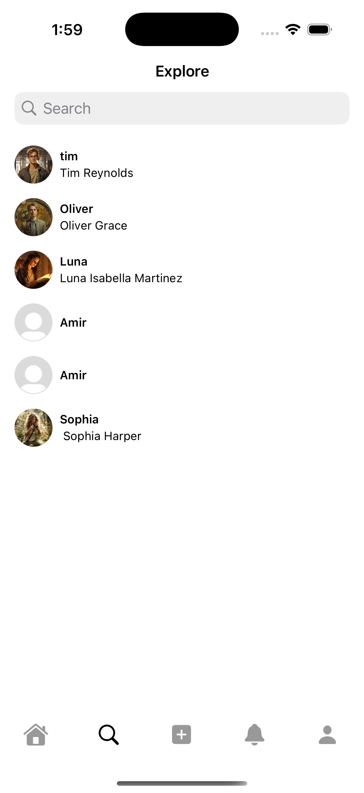

# Instagram Clone (iOS)

## Overview
This project is an Instagram clone built for iOS using Swift and Firebase. It replicates core Instagram features, allowing users to sign up, log in, upload photos, follow users, like posts, and more.

## Features
- User authentication (Sign up, Login, Logout) via Firebase Authentication
- Upload and display photos using Firebase Storage
- Create and manage user profiles
- Like and comment on posts
- Follow and unfollow users
- Real-time updates using Firebase Firestore
- Responsive and user-friendly UI

## Technologies Used
- **Swift** (SwiftUI)
- **Firebase Authentication** (for user authentication)
- **Firebase Firestore** (for real-time database)
- **Firebase Storage** (for image uploads)
- **CocoaPods** (for dependency management)

## Screenshots

